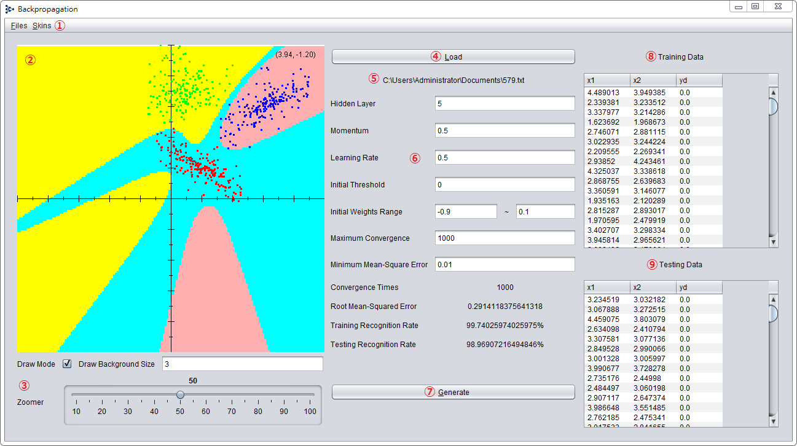
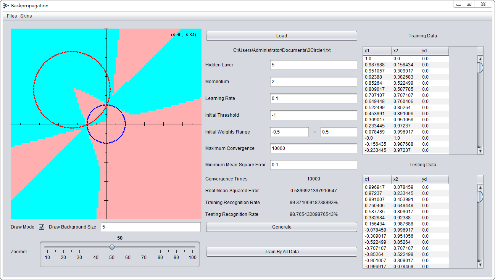
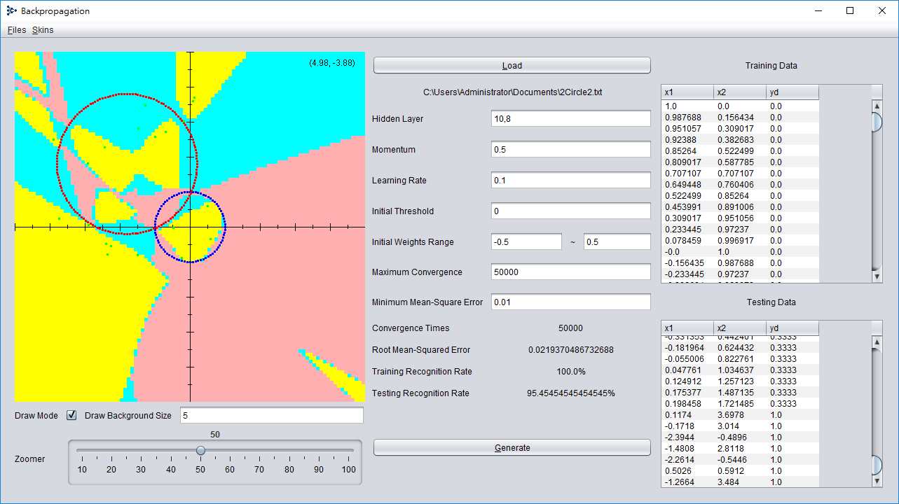

# Backpropagation

Using Java Swing to implement backpropagation neural network. Learning algorithm can refer to [this](https://en.wikipedia.org/wiki/Backpropagation) Wikipedia page. 

Input consists of several groups of multi-dimensional data set, The data were cut into three parts (each number roughly equal to the same group), 2/3 of the data given to training function, and the remaining 1/3 of the data given to testing function.

The purpose of program is training to cut a number of groups of hyperplanes and synaptic weights, and display the results in the graphical interface.

## Getting Started

	git clone https://github.com/Jasonnor/Backpropagation.git
    cd Backpropagation
    Backpropagation.jar

1. Menu (Files, Skins)
2. Output
3. background rendering mode & zoom level
4. Read the file
5. File path
6. Adjustable parameters
7. Output parameters
8. Generate new results
9. List of training materials (2/3 of total data)
10. List of test data (1/3 of total data)

Be careful to use background rendering mode, and notice that too small drawing size will delay the computer.

## Input Data Format

    InputA InputB OutputA
    InputC InputD OutputB
    ...

You can use these [data sets](data) for testing.

## Result

## Contributing

Please feel free to use it if you are interested in fixing issues and contributing directly to the code base.

## License

Backpropagation is released under the MIT license. See the [LICENSE](/LICENSE) file for details.
